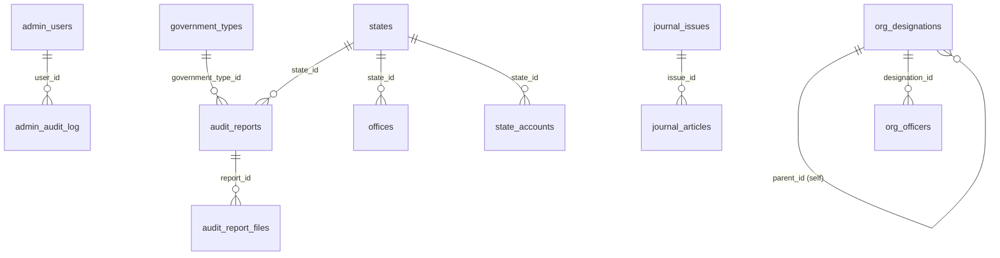

# Database Schema Analysis — CAG Admin Panel & Public Frontend

> **Generated**: 26 Aug 2026  
> **Project**: `new_cag_ui` (Next.js 16 + PostgreSQL)  
> **Database**: `d_cag` → Schema: `cag_new`  
> **Method**: Full codebase scan of every `admin-modules.ts` config, API route SQL query, frontend `types/index.ts`, `dataManager.ts`, dashboard aggregations, and auth flow.

---

## Executive Summary

| Metric | Value |
|---|---|
| **Total Tables Required** | **22** |
| **Total Unique Columns (across all tables)** | **227** |
| **Tables Used by Admin Panel (backend)** | 22 |
| **Tables Used by Public Frontend** | 10 |
| **Tables Used by Both** | 10 |
| **Foreign Key Relationships** | 8 |

---

## Table Index

| # | Table Name | Columns | Used By Admin | Used By Frontend | FK References |
|---|---|---|---|---|---|
| 1 | `admin_users` | 11 | ✅ Login, CRUD, Dashboard | — | — |
| 2 | `admin_audit_log` | 7 | ✅ List, Dashboard | — | → `admin_users.id` |
| 3 | `audit_reports` | 16 | ✅ CRUD | ✅ Reports page, Home page | → `government_types.id`, → `states.id` |
| 4 | `audit_report_files` | 7 | ✅ List/CRUD | — | → `audit_reports.id` |
| 5 | `news` | 12 | ✅ CRUD | ✅ Home News section | — |
| 6 | `notifications` | 10 | ✅ CRUD | ✅ Home ticker | — |
| 7 | `banners` | 10 | ✅ CRUD | ✅ Home carousel | — |
| 8 | `pages` | 12 | ✅ CRUD | ✅ Dynamic CMS pages | — |
| 9 | `publications` | 11 | ✅ CRUD | — | — |
| 10 | `media_gallery` | 11 | ✅ CRUD | — | — |
| 11 | `events` | 12 | ✅ CRUD | — | — |
| 12 | `faqs` | 9 | ✅ CRUD | — | — |
| 13 | `quick_links` | 9 | ✅ CRUD | — | — |
| 14 | `recruitment_notices` | 10 | ✅ CRUD | — | — |
| 15 | `tenders` | 10 | ✅ CRUD | — | — |
| 16 | `former_cags` | 11 | ✅ CRUD | ✅ About/Former CAGs | — |
| 17 | `org_designations` | 8 | ✅ CRUD | ✅ Org chart (via API) | → `org_designations.id` (self-ref) |
| 18 | `org_officers` | 13 | ✅ CRUD | ✅ Org chart (via API) | → `org_designations.id` |
| 19 | `public_consultations` | 12 | ✅ CRUD | — | — |
| 20 | `offices` | 14 | ✅ CRUD | ✅ Our Presence map | → `states.id` |
| 21 | `states` | 5 | ✅ CRUD (master) | ✅ Reports filter, Offices | — |
| 22 | `government_types` | 5 | ✅ CRUD (master) | ✅ Reports filter | — |
| — | `state_accounts` | 11 | ✅ CRUD | — | → `states.id` |
| — | `journal_issues` | 10 | ✅ CRUD | — | — |
| — | `journal_articles` | 10 | ✅ CRUD | — | → `journal_issues.id` |
| — | `contact_submissions` | 8 | ✅ List/Read | — | — |

---

## Detailed Table Schemas

### Table 1: `admin_users`
> **Purpose**: Admin panel authentication & user management  
> **Used by**: Auth login (`auth.ts`), Users list page, Dashboard count, Audit log JOINs

| # | Column | Type | Nullable | Default | Constraints | Used By |
|---|---|---|---|---|---|---|
| 1 | `id` | `SERIAL` | NO | auto | PRIMARY KEY | Auth, audit_log FK |
| 2 | `username` | `VARCHAR(100)` | NO | — | UNIQUE | Auth login, list search |
| 3 | `password_hash` | `VARCHAR(255)` | NO | — | — | Auth bcrypt compare |
| 4 | `email` | `VARCHAR(255)` | YES | — | — | Auth session, list col |
| 5 | `full_name` | `VARCHAR(255)` | YES | — | — | Auth session.name, list col |
| 6 | `role` | `VARCHAR(50)` | YES | `'admin'` | — | Auth session.role, list col |
| 7 | `is_active` | `BOOLEAN` | NO | `true` | — | Auth WHERE, list filter |
| 8 | `last_login` | `TIMESTAMP` | YES | — | — | Updated on login |
| 9 | `created_at` | `TIMESTAMP` | YES | `NOW()` | — | Tracking |
| 10 | `updated_at` | `TIMESTAMP` | YES | — | — | Updated on login |
| 11 | `created_by` | `INTEGER` | YES | — | — | CRUD auto-set |

---

### Table 2: `admin_audit_log`
> **Purpose**: Tracks all admin CRUD operations  
> **Used by**: Dashboard recent activity, Audit Log list page

| # | Column | Type | Nullable | Default | Constraints | Used By |
|---|---|---|---|---|---|---|
| 1 | `id` | `SERIAL` | NO | auto | PRIMARY KEY | — |
| 2 | `user_id` | `INTEGER` | YES | — | FK → `admin_users.id` | Dashboard JOIN |
| 3 | `action` | `VARCHAR(50)` | NO | — | — | List col, search |
| 4 | `table_name` | `VARCHAR(100)` | NO | — | — | List col |
| 5 | `record_id` | `INTEGER` | YES | — | — | List col |
| 6 | `ip_address` | `VARCHAR(50)` | YES | — | — | List col |
| 7 | `created_at` | `TIMESTAMP` | YES | `NOW()` | — | List col, Dashboard sort |

---

### Table 3: `audit_reports`
> **Purpose**: Core audit reports with file attachments  
> **Used by**: Admin CRUD, Public Reports page, Home Latest Reports, Reports detail page

| # | Column | Type | Nullable | Default | Constraints | Used By |
|---|---|---|---|---|---|---|
| 1 | `id` | `SERIAL` | NO | auto | PRIMARY KEY | Detail page, files FK |
| 2 | `title_en` | `VARCHAR(500)` | NO | — | — | Search, list col, frontend display |
| 3 | `title_hi` | `VARCHAR(500)` | YES | — | — | Hindi title |
| 4 | `overview_en` | `TEXT` | YES | — | — | Admin form, frontend description |
| 5 | `overview_hi` | `TEXT` | YES | — | — | Hindi overview |
| 6 | `government_type_id` | `INTEGER` | YES | — | FK → `government_types.id` | Filter select, JOIN |
| 7 | `state_id` | `INTEGER` | YES | — | FK → `states.id` | Filter select, JOIN |
| 8 | `report_type` | `VARCHAR(100)` | YES | — | — | List col, frontend badge |
| 9 | `sector` | `VARCHAR(200)` | YES | — | — | List col, frontend filter |
| 10 | `year_of_report` | `INTEGER` | YES | — | — | List col, sort, frontend |
| 11 | `date_tabled` | `DATE` | YES | — | — | Frontend published_date |
| 12 | `main_report_file` | `VARCHAR(500)` | YES | — | — | Download CTA, frontend |
| 13 | `noody_book_file` | `VARCHAR(500)` | YES | — | — | Frontend |
| 14 | `youtube_video_url` | `VARCHAR(500)` | YES | — | — | Frontend |
| 15 | `digital_report_url` | `VARCHAR(500)` | YES | — | — | Frontend |
| 16 | `is_active` | `BOOLEAN` | NO | `true` | — | WHERE filter |
| 17 | `created_by` | `INTEGER` | YES | — | — | CRUD auto-set |
| 18 | `created_at` | `TIMESTAMP` | YES | `NOW()` | — | List col |
| 19 | `updated_by` | `INTEGER` | YES | — | — | CRUD auto-set |
| 20 | `updated_at` | `TIMESTAMP` | YES | — | — | CRUD auto-set |

---

### Table 4: `audit_report_files`
> **Purpose**: Additional files attached to audit reports  
> **Used by**: Admin list/CRUD

| # | Column | Type | Nullable | Default | Constraints | Used By |
|---|---|---|---|---|---|---|
| 1 | `id` | `SERIAL` | NO | auto | PRIMARY KEY | — |
| 2 | `report_id` | `INTEGER` | NO | — | FK → `audit_reports.id` | List col |
| 3 | `file_type` | `VARCHAR(100)` | YES | — | — | List col, search |
| 4 | `file_url` | `VARCHAR(500)` | YES | — | — | List col (link) |
| 5 | `display_order` | `INTEGER` | YES | `0` | — | List col |
| 6 | `is_active` | `BOOLEAN` | NO | `true` | — | List filter |
| 7 | `created_at` | `TIMESTAMP` | YES | `NOW()` | — | Tracking |

---

### Table 5: `news`
> **Purpose**: News articles, press releases, announcements  
> **Used by**: Admin CRUD, Home News & Events section

| # | Column | Type | Nullable | Default | Constraints | Used By |
|---|---|---|---|---|---|---|
| 1 | `id` | `SERIAL` | NO | auto | PRIMARY KEY | — |
| 2 | `title_en` | `VARCHAR(500)` | NO | — | — | Search, list, frontend |
| 3 | `title_hi` | `VARCHAR(500)` | YES | — | — | Hindi |
| 4 | `content_en` | `TEXT` | YES | — | — | Frontend desc |
| 5 | `content_hi` | `TEXT` | YES | — | — | Hindi |
| 6 | `news_type` | `VARCHAR(50)` | YES | `'general'` | — | List col, frontend type filter |
| 7 | `tag` | `VARCHAR(100)` | YES | — | — | List col, frontend badge |
| 8 | `image_url` | `VARCHAR(500)` | YES | — | — | Frontend image |
| 9 | `publish_date` | `DATE` | YES | — | — | List col, frontend sort |
| 10 | `is_active` | `BOOLEAN` | NO | `true` | — | WHERE filter |
| 11 | `created_by` | `INTEGER` | YES | — | — | CRUD |
| 12 | `created_at` | `TIMESTAMP` | YES | `NOW()` | — | Tracking |
| 13 | `updated_by` | `INTEGER` | YES | — | — | CRUD |
| 14 | `updated_at` | `TIMESTAMP` | YES | — | — | CRUD |

---

### Table 6: `notifications`
> **Purpose**: Site-wide notifications (tickers, alerts)  
> **Used by**: Admin CRUD, Home notification ticker

| # | Column | Type | Nullable | Default | Constraints | Used By |
|---|---|---|---|---|---|---|
| 1 | `id` | `SERIAL` | NO | auto | PRIMARY KEY | — |
| 2 | `title_en` | `VARCHAR(500)` | NO | — | — | Search, list, frontend |
| 3 | `title_hi` | `VARCHAR(500)` | YES | — | — | Hindi |
| 4 | `content_type` | `VARCHAR(50)` | YES | `'link'` | — | List col |
| 5 | `link_url` | `VARCHAR(500)` | YES | — | — | Frontend |
| 6 | `file_url` | `VARCHAR(500)` | YES | — | — | Frontend |
| 7 | `publish_date` | `DATE` | YES | — | — | List col, sort |
| 8 | `expiry_date` | `DATE` | YES | — | — | List col, WHERE filter |
| 9 | `is_active` | `BOOLEAN` | NO | `true` | — | WHERE filter |
| 10 | `created_by` | `INTEGER` | YES | — | — | CRUD |
| 11 | `created_at` | `TIMESTAMP` | YES | `NOW()` | — | Tracking |
| 12 | `updated_by` | `INTEGER` | YES | — | — | CRUD |
| 13 | `updated_at` | `TIMESTAMP` | YES | — | — | CRUD |

---

### Table 7: `banners`
> **Purpose**: Homepage hero carousel slides  
> **Used by**: Admin CRUD, Home banner carousel

| # | Column | Type | Nullable | Default | Constraints | Used By |
|---|---|---|---|---|---|---|
| 1 | `id` | `SERIAL` | NO | auto | PRIMARY KEY | — |
| 2 | `title_en` | `VARCHAR(300)` | NO | — | — | Search, list, frontend |
| 3 | `title_hi` | `VARCHAR(300)` | YES | — | — | Frontend Hindi |
| 4 | `subtitle_en` | `VARCHAR(500)` | YES | — | — | Frontend subtitle |
| 5 | `subtitle_hi` | `VARCHAR(500)` | YES | — | — | Frontend Hindi |
| 6 | `image_url` | `VARCHAR(500)` | NO | — | — | List col, frontend bg |
| 7 | `link_url` | `VARCHAR(500)` | YES | — | — | — |
| 8 | `display_order` | `INTEGER` | YES | `0` | — | List col, ORDER BY |
| 9 | `is_active` | `BOOLEAN` | NO | `true` | — | WHERE filter |
| 10 | `created_by` | `INTEGER` | YES | — | — | CRUD |
| 11 | `created_at` | `TIMESTAMP` | YES | `NOW()` | — | Tracking |
| 12 | `updated_by` | `INTEGER` | YES | — | — | CRUD |
| 13 | `updated_at` | `TIMESTAMP` | YES | — | — | CRUD |

---

### Table 8: `pages`
> **Purpose**: CMS dynamic pages (About, Governance, etc.)  
> **Used by**: Admin CRUD, Public `/api/pages/[slug]`

| # | Column | Type | Nullable | Default | Constraints | Used By |
|---|---|---|---|---|---|---|
| 1 | `id` | `SERIAL` | NO | auto | PRIMARY KEY | — |
| 2 | `title_en` | `VARCHAR(300)` | NO | — | — | Search, list, frontend |
| 3 | `title_hi` | `VARCHAR(300)` | YES | — | — | Hindi |
| 4 | `slug` | `VARCHAR(255)` | NO | — | UNIQUE | API route param, list col |
| 5 | `section` | `VARCHAR(100)` | YES | — | — | List col |
| 6 | `content_en` | `TEXT` | YES | — | — | Frontend content_html |
| 7 | `content_hi` | `TEXT` | YES | — | — | Hindi |
| 8 | `meta_description` | `TEXT` | YES | — | — | Frontend SEO |
| 9 | `display_order` | `INTEGER` | YES | `0` | — | ORDER BY |
| 10 | `is_active` | `BOOLEAN` | NO | `true` | — | WHERE filter |
| 11 | `created_by` | `INTEGER` | YES | — | — | CRUD |
| 12 | `created_at` | `TIMESTAMP` | YES | `NOW()` | — | Tracking |
| 13 | `updated_by` | `INTEGER` | YES | — | — | CRUD |
| 14 | `updated_at` | `TIMESTAMP` | YES | — | — | CRUD |

---

### Table 9: `publications`
> **Purpose**: Circulars, manuals, guidelines, notices  
> **Used by**: Admin CRUD, Dashboard count

| # | Column | Type | Nullable | Default | Constraints | Used By |
|---|---|---|---|---|---|---|
| 1 | `id` | `SERIAL` | NO | auto | PRIMARY KEY | — |
| 2 | `title_en` | `VARCHAR(500)` | NO | — | — | Search, list |
| 3 | `title_hi` | `VARCHAR(500)` | YES | — | — | Hindi |
| 4 | `pub_type` | `VARCHAR(50)` | NO | — | — | List col |
| 5 | `description_en` | `TEXT` | YES | — | — | Admin form |
| 6 | `description_hi` | `TEXT` | YES | — | — | Hindi |
| 7 | `file_url` | `VARCHAR(500)` | YES | — | — | — |
| 8 | `publish_date` | `DATE` | YES | — | — | List col |
| 9 | `display_order` | `INTEGER` | YES | `0` | — | ORDER BY |
| 10 | `is_active` | `BOOLEAN` | NO | `true` | — | WHERE filter |
| 11 | `created_by` | `INTEGER` | YES | — | — | CRUD |
| 12 | `created_at` | `TIMESTAMP` | YES | `NOW()` | — | Tracking |
| 13 | `updated_by` | `INTEGER` | YES | — | — | CRUD |
| 14 | `updated_at` | `TIMESTAMP` | YES | — | — | CRUD |

---

### Table 10: `media_gallery`
> **Purpose**: Photo and video gallery  
> **Used by**: Admin CRUD, Dashboard count

| # | Column | Type | Nullable | Default | Constraints | Used By |
|---|---|---|---|---|---|---|
| 1 | `id` | `SERIAL` | NO | auto | PRIMARY KEY | — |
| 2 | `title_en` | `VARCHAR(300)` | NO | — | — | Search, list |
| 3 | `title_hi` | `VARCHAR(300)` | YES | — | — | Hindi |
| 4 | `media_type` | `VARCHAR(20)` | NO | — | — | List col |
| 5 | `file_url` | `VARCHAR(500)` | YES | — | — | Admin form |
| 6 | `video_url` | `VARCHAR(500)` | YES | — | — | Admin form |
| 7 | `thumbnail_url` | `VARCHAR(500)` | YES | — | — | Admin form |
| 8 | `gallery_date` | `DATE` | YES | — | — | List col |
| 9 | `display_order` | `INTEGER` | YES | `0` | — | ORDER BY |
| 10 | `is_active` | `BOOLEAN` | NO | `true` | — | WHERE filter |
| 11 | `created_by` | `INTEGER` | YES | — | — | CRUD |
| 12 | `created_at` | `TIMESTAMP` | YES | `NOW()` | — | Tracking |
| 13 | `updated_by` | `INTEGER` | YES | — | — | CRUD |
| 14 | `updated_at` | `TIMESTAMP` | YES | — | — | CRUD |

---

### Table 11: `events`
> **Purpose**: Events/conferences with venue and dates  
> **Used by**: Admin CRUD, Dashboard count

| # | Column | Type | Nullable | Default | Constraints | Used By |
|---|---|---|---|---|---|---|
| 1 | `id` | `SERIAL` | NO | auto | PRIMARY KEY | — |
| 2 | `title_en` | `VARCHAR(500)` | NO | — | — | Search, list |
| 3 | `title_hi` | `VARCHAR(500)` | YES | — | — | Hindi |
| 4 | `description_en` | `TEXT` | YES | — | — | Admin form |
| 5 | `description_hi` | `TEXT` | YES | — | — | Hindi |
| 6 | `venue` | `VARCHAR(300)` | YES | — | — | List col |
| 7 | `start_date` | `DATE` | YES | — | — | List col |
| 8 | `end_date` | `DATE` | YES | — | — | List col |
| 9 | `image_url` | `VARCHAR(500)` | YES | — | — | Admin form |
| 10 | `file_url` | `VARCHAR(500)` | YES | — | — | Admin form |
| 11 | `is_active` | `BOOLEAN` | NO | `true` | — | WHERE filter |
| 12 | `created_by` | `INTEGER` | YES | — | — | CRUD |
| 13 | `created_at` | `TIMESTAMP` | YES | `NOW()` | — | Tracking |
| 14 | `updated_by` | `INTEGER` | YES | — | — | CRUD |
| 15 | `updated_at` | `TIMESTAMP` | YES | — | — | CRUD |

---

### Table 12: `faqs`
> **Purpose**: Frequently asked questions with bilingual Q&A  
> **Used by**: Admin CRUD

| # | Column | Type | Nullable | Default | Constraints | Used By |
|---|---|---|---|---|---|---|
| 1 | `id` | `SERIAL` | NO | auto | PRIMARY KEY | — |
| 2 | `question_en` | `TEXT` | NO | — | — | Search, list |
| 3 | `question_hi` | `TEXT` | YES | — | — | Hindi |
| 4 | `answer_en` | `TEXT` | NO | — | — | Admin form |
| 5 | `answer_hi` | `TEXT` | YES | — | — | Hindi |
| 6 | `category` | `VARCHAR(100)` | YES | — | — | List col |
| 7 | `display_order` | `INTEGER` | YES | `0` | — | List col, ORDER BY |
| 8 | `is_active` | `BOOLEAN` | NO | `true` | — | WHERE filter |
| 9 | `created_by` | `INTEGER` | YES | — | — | CRUD |
| 10 | `created_at` | `TIMESTAMP` | YES | `NOW()` | — | Tracking |
| 11 | `updated_by` | `INTEGER` | YES | — | — | CRUD |
| 12 | `updated_at` | `TIMESTAMP` | YES | — | — | CRUD |

---

### Table 13: `quick_links`
> **Purpose**: Quick link shortcuts on homepage  
> **Used by**: Admin CRUD

| # | Column | Type | Nullable | Default | Constraints | Used By |
|---|---|---|---|---|---|---|
| 1 | `id` | `SERIAL` | NO | auto | PRIMARY KEY | — |
| 2 | `title_en` | `VARCHAR(300)` | NO | — | — | Search, list |
| 3 | `title_hi` | `VARCHAR(300)` | YES | — | — | Hindi |
| 4 | `url` | `VARCHAR(500)` | NO | — | — | List col (link) |
| 5 | `link_type` | `VARCHAR(20)` | YES | `'external'` | — | List col |
| 6 | `icon_url` | `VARCHAR(500)` | YES | — | — | Admin form |
| 7 | `display_order` | `INTEGER` | YES | `0` | — | List col, ORDER BY |
| 8 | `is_active` | `BOOLEAN` | NO | `true` | — | WHERE filter |
| 9 | `created_by` | `INTEGER` | YES | — | — | CRUD |
| 10 | `created_at` | `TIMESTAMP` | YES | `NOW()` | — | Tracking |
| 11 | `updated_by` | `INTEGER` | YES | — | — | CRUD |
| 12 | `updated_at` | `TIMESTAMP` | YES | — | — | CRUD |

---

### Table 14: `recruitment_notices`
> **Purpose**: Job recruitment announcements  
> **Used by**: Admin CRUD, Dashboard count

| # | Column | Type | Nullable | Default | Constraints | Used By |
|---|---|---|---|---|---|---|
| 1 | `id` | `SERIAL` | NO | auto | PRIMARY KEY | — |
| 2 | `title_en` | `VARCHAR(500)` | NO | — | — | Search, list |
| 3 | `title_hi` | `VARCHAR(500)` | YES | — | — | Hindi |
| 4 | `description_en` | `TEXT` | YES | — | — | Admin form |
| 5 | `description_hi` | `TEXT` | YES | — | — | Hindi |
| 6 | `file_url` | `VARCHAR(500)` | YES | — | — | Admin form |
| 7 | `notice_date` | `DATE` | NO | — | — | List col |
| 8 | `closing_date` | `DATE` | YES | — | — | List col |
| 9 | `is_active` | `BOOLEAN` | NO | `true` | — | WHERE filter |
| 10 | `created_by` | `INTEGER` | YES | — | — | CRUD |
| 11 | `created_at` | `TIMESTAMP` | YES | `NOW()` | — | Tracking |
| 12 | `updated_by` | `INTEGER` | YES | — | — | CRUD |
| 13 | `updated_at` | `TIMESTAMP` | YES | — | — | CRUD |

---

### Table 15: `tenders`
> **Purpose**: Tender notices & procurement  
> **Used by**: Admin CRUD, Dashboard count

| # | Column | Type | Nullable | Default | Constraints | Used By |
|---|---|---|---|---|---|---|
| 1 | `id` | `SERIAL` | NO | auto | PRIMARY KEY | — |
| 2 | `title_en` | `VARCHAR(500)` | NO | — | — | Search, list |
| 3 | `title_hi` | `VARCHAR(500)` | YES | — | — | Hindi |
| 4 | `reference_no` | `VARCHAR(100)` | YES | — | — | List col |
| 5 | `file_url` | `VARCHAR(500)` | YES | — | — | Admin form |
| 6 | `issue_date` | `DATE` | YES | — | — | List col |
| 7 | `submission_date` | `DATE` | YES | — | — | Admin form |
| 8 | `last_date` | `DATE` | YES | — | — | List col |
| 9 | `is_active` | `BOOLEAN` | NO | `true` | — | WHERE filter |
| 10 | `created_by` | `INTEGER` | YES | — | — | CRUD |
| 11 | `created_at` | `TIMESTAMP` | YES | `NOW()` | — | Tracking |
| 12 | `updated_by` | `INTEGER` | YES | — | — | CRUD |
| 13 | `updated_at` | `TIMESTAMP` | YES | — | — | CRUD |

---

### Table 16: `former_cags`
> **Purpose**: List of former Comptrollers and Auditors General  
> **Used by**: Admin CRUD, About page

| # | Column | Type | Nullable | Default | Constraints | Used By |
|---|---|---|---|---|---|---|
| 1 | `id` | `SERIAL` | NO | auto | PRIMARY KEY | — |
| 2 | `name_en` | `VARCHAR(200)` | NO | — | — | Search, list, frontend |
| 3 | `name_hi` | `VARCHAR(200)` | YES | — | — | Hindi |
| 4 | `tenure_from` | `VARCHAR(20)` | YES | — | — | List col, frontend |
| 5 | `tenure_to` | `VARCHAR(20)` | YES | — | — | List col, frontend |
| 6 | `description_en` | `TEXT` | YES | — | — | Frontend |
| 7 | `description_hi` | `TEXT` | YES | — | — | Hindi |
| 8 | `image_url` | `VARCHAR(500)` | YES | — | — | Frontend portrait |
| 9 | `display_order` | `INTEGER` | YES | `0` | — | List col, ORDER BY |
| 10 | `is_active` | `BOOLEAN` | NO | `true` | — | WHERE filter |
| 11 | `created_by` | `INTEGER` | YES | — | — | CRUD |
| 12 | `created_at` | `TIMESTAMP` | YES | `NOW()` | — | Tracking |
| 13 | `updated_by` | `INTEGER` | YES | — | — | CRUD |
| 14 | `updated_at` | `TIMESTAMP` | YES | — | — | CRUD |

---

### Table 17: `org_designations`
> **Purpose**: Organisational designation hierarchy  
> **Used by**: Admin CRUD, Officers form select, Org chart API

| # | Column | Type | Nullable | Default | Constraints | Used By |
|---|---|---|---|---|---|---|
| 1 | `id` | `SERIAL` | NO | auto | PRIMARY KEY | — |
| 2 | `title_en` | `VARCHAR(300)` | NO | — | — | Search, list, API options |
| 3 | `title_hi` | `VARCHAR(300)` | YES | — | — | Hindi |
| 4 | `parent_id` | `INTEGER` | YES | — | FK → self | Admin form, API tree |
| 5 | `level` | `INTEGER` | YES | `1` | — | List col, API tier |
| 6 | `display_order` | `INTEGER` | YES | `0` | — | List col, ORDER BY |
| 7 | `is_active` | `BOOLEAN` | NO | `true` | — | WHERE filter |
| 8 | `created_at` | `TIMESTAMP` | YES | `NOW()` | — | Tracking |

---

### Table 18: `org_officers`
> **Purpose**: Individual officers mapped to designations  
> **Used by**: Admin CRUD, Org Chart API

| # | Column | Type | Nullable | Default | Constraints | Used By |
|---|---|---|---|---|---|---|
| 1 | `id` | `SERIAL` | NO | auto | PRIMARY KEY | — |
| 2 | `prefix` | `VARCHAR(20)` | YES | — | — | Admin form, API name |
| 3 | `full_name_en` | `VARCHAR(200)` | NO | — | — | Search, list, API |
| 4 | `full_name_hi` | `VARCHAR(200)` | YES | — | — | Hindi |
| 5 | `designation_id` | `INTEGER` | NO | — | FK → `org_designations.id` | Admin form, API JOIN |
| 6 | `email` | `VARCHAR(255)` | YES | — | — | List col, API |
| 7 | `phone` | `VARCHAR(50)` | YES | — | — | API |
| 8 | `profile_image` | `VARCHAR(500)` | YES | — | — | Admin form |
| 9 | `brief_description` | `TEXT` | YES | — | — | Admin form |
| 10 | `charge_from` | `DATE` | YES | — | — | List col |
| 11 | `charge_to` | `DATE` | YES | — | — | Admin form |
| 12 | `is_active` | `BOOLEAN` | NO | `true` | — | WHERE filter |
| 13 | `created_by` | `INTEGER` | YES | — | — | CRUD |
| 14 | `created_at` | `TIMESTAMP` | YES | `NOW()` | — | Tracking |
| 15 | `updated_by` | `INTEGER` | YES | — | — | CRUD |
| 16 | `updated_at` | `TIMESTAMP` | YES | — | — | CRUD |

---

### Table 19: `public_consultations`
> **Purpose**: Public consultation documents & comment tracking  
> **Used by**: Admin CRUD, Dashboard count

| # | Column | Type | Nullable | Default | Constraints | Used By |
|---|---|---|---|---|---|---|
| 1 | `id` | `SERIAL` | NO | auto | PRIMARY KEY | — |
| 2 | `title_en` | `VARCHAR(500)` | NO | — | — | Search, list |
| 3 | `title_hi` | `VARCHAR(500)` | YES | — | — | Hindi |
| 4 | `description_en` | `TEXT` | YES | — | — | Admin form |
| 5 | `description_hi` | `TEXT` | YES | — | — | Hindi |
| 6 | `file_url` | `VARCHAR(500)` | YES | — | — | Admin form |
| 7 | `publish_date` | `DATE` | YES | — | — | List col |
| 8 | `expiry_date` | `DATE` | YES | — | — | List col |
| 9 | `total_views` | `INTEGER` | YES | `0` | — | List col |
| 10 | `total_downloads` | `INTEGER` | YES | `0` | — | List col |
| 11 | `is_active` | `BOOLEAN` | NO | `true` | — | WHERE filter |
| 12 | `created_by` | `INTEGER` | YES | — | — | CRUD |
| 13 | `created_at` | `TIMESTAMP` | YES | `NOW()` | — | Tracking |
| 14 | `updated_by` | `INTEGER` | YES | — | — | CRUD |
| 15 | `updated_at` | `TIMESTAMP` | YES | — | — | CRUD |

---

### Table 20: `offices`
> **Purpose**: CAG offices (central, state, training)  
> **Used by**: Admin CRUD, Public Our Presence map/list

| # | Column | Type | Nullable | Default | Constraints | Used By |
|---|---|---|---|---|---|---|
| 1 | `id` | `SERIAL` | NO | auto | PRIMARY KEY | — |
| 2 | `name_en` | `VARCHAR(300)` | NO | — | — | Search, list, frontend |
| 3 | `name_hi` | `VARCHAR(300)` | YES | — | — | Hindi |
| 4 | `office_type` | `VARCHAR(20)` | NO | — | — | List col, frontend filter |
| 5 | `sub_type` | `VARCHAR(100)` | YES | — | — | Admin form |
| 6 | `state_id` | `INTEGER` | YES | — | FK → `states.id` | Admin form, API JOIN |
| 7 | `address` | `TEXT` | YES | — | — | Admin form, frontend |
| 8 | `phone` | `VARCHAR(50)` | YES | — | — | List col, frontend |
| 9 | `email` | `VARCHAR(255)` | YES | — | — | List col, frontend |
| 10 | `website_url` | `VARCHAR(500)` | YES | — | — | Admin form |
| 11 | `latitude` | `VARCHAR(30)` | YES | — | — | Frontend map (float) |
| 12 | `longitude` | `VARCHAR(30)` | YES | — | — | Frontend map (float) |
| 13 | `display_order` | `INTEGER` | YES | `0` | — | ORDER BY |
| 14 | `is_active` | `BOOLEAN` | NO | `true` | — | WHERE filter |
| 15 | `created_by` | `INTEGER` | YES | — | — | CRUD |
| 16 | `created_at` | `TIMESTAMP` | YES | `NOW()` | — | Tracking |
| 17 | `updated_by` | `INTEGER` | YES | — | — | CRUD |
| 18 | `updated_at` | `TIMESTAMP` | YES | — | — | CRUD |

---

### Table 21: `states`
> **Purpose**: Indian states and UTs master list  
> **Used by**: Admin CRUD, API options dropdown, Offices JOIN, Reports JOIN

| # | Column | Type | Nullable | Default | Constraints | Used By |
|---|---|---|---|---|---|---|
| 1 | `id` | `SERIAL` | NO | auto | PRIMARY KEY | — |
| 2 | `code` | `VARCHAR(5)` | NO | — | UNIQUE | List col |
| 3 | `name_en` | `VARCHAR(100)` | NO | — | — | Search, list, API options |
| 4 | `name_hi` | `VARCHAR(100)` | YES | — | — | Hindi |
| 5 | `is_active` | `BOOLEAN` | NO | `true` | — | WHERE filter |

---

### Table 22: `government_types`
> **Purpose**: Government type master (Union, States, UT)  
> **Used by**: Admin CRUD, API options dropdown, Reports JOIN

| # | Column | Type | Nullable | Default | Constraints | Used By |
|---|---|---|---|---|---|---|
| 1 | `id` | `SERIAL` | NO | auto | PRIMARY KEY | — |
| 2 | `name_en` | `VARCHAR(100)` | NO | — | — | Search, list, API options |
| 3 | `name_hi` | `VARCHAR(100)` | YES | — | — | Hindi |
| 4 | `is_active` | `BOOLEAN` | NO | `true` | — | WHERE filter |

---

### Table 23: `state_accounts`
> **Purpose**: State financial accounts and statements  
> **Used by**: Admin CRUD

| # | Column | Type | Nullable | Default | Constraints | Used By |
|---|---|---|---|---|---|---|
| 1 | `id` | `SERIAL` | NO | auto | PRIMARY KEY | — |
| 2 | `title_en` | `VARCHAR(500)` | NO | — | — | Search, list |
| 3 | `title_hi` | `VARCHAR(500)` | YES | — | — | Hindi |
| 4 | `state_id` | `INTEGER` | YES | — | FK → `states.id` | Admin form |
| 5 | `account_year` | `INTEGER` | NO | — | — | List col |
| 6 | `month` | `VARCHAR(20)` | YES | — | — | List col |
| 7 | `volume` | `VARCHAR(50)` | YES | — | — | List col |
| 8 | `file_url` | `VARCHAR(500)` | YES | — | — | Admin form |
| 9 | `external_link` | `VARCHAR(500)` | YES | — | — | Admin form |
| 10 | `is_active` | `BOOLEAN` | NO | `true` | — | WHERE filter |
| 11 | `created_by` | `INTEGER` | YES | — | — | CRUD |
| 12 | `created_at` | `TIMESTAMP` | YES | `NOW()` | — | Tracking |
| 13 | `updated_by` | `INTEGER` | YES | — | — | CRUD |
| 14 | `updated_at` | `TIMESTAMP` | YES | — | — | CRUD |

---

### Table 24: `journal_issues`
> **Purpose**: International Journal of Government Auditing issue volumes  
> **Used by**: Admin CRUD, Articles FK

| # | Column | Type | Nullable | Default | Constraints | Used By |
|---|---|---|---|---|---|---|
| 1 | `id` | `SERIAL` | NO | auto | PRIMARY KEY | — |
| 2 | `volume_number` | `INTEGER` | NO | — | — | List col, API options |
| 3 | `issue_number` | `INTEGER` | NO | — | — | List col, API options |
| 4 | `year` | `INTEGER` | NO | — | — | List col, API options |
| 5 | `issn` | `VARCHAR(30)` | YES | — | — | Search, list |
| 6 | `publication_date` | `DATE` | YES | — | — | List col |
| 7 | `cover_image` | `VARCHAR(500)` | YES | — | — | Admin form |
| 8 | `full_pdf_url` | `VARCHAR(500)` | YES | — | — | Admin form |
| 9 | `is_active` | `BOOLEAN` | NO | `true` | — | WHERE filter |
| 10 | `created_at` | `TIMESTAMP` | YES | `NOW()` | — | Tracking |

---

### Table 25: `journal_articles`
> **Purpose**: Individual articles within journal issues  
> **Used by**: Admin CRUD

| # | Column | Type | Nullable | Default | Constraints | Used By |
|---|---|---|---|---|---|---|
| 1 | `id` | `SERIAL` | NO | auto | PRIMARY KEY | — |
| 2 | `issue_id` | `INTEGER` | NO | — | FK → `journal_issues.id` | Admin form |
| 3 | `title` | `VARCHAR(500)` | NO | — | — | Search, list |
| 4 | `author` | `VARCHAR(300)` | YES | — | — | List col |
| 5 | `keywords` | `VARCHAR(500)` | YES | — | — | Admin form |
| 6 | `doi` | `VARCHAR(100)` | YES | — | — | List col |
| 7 | `file_url` | `VARCHAR(500)` | YES | — | — | Admin form |
| 8 | `display_order` | `INTEGER` | YES | `0` | — | List col, ORDER BY |
| 9 | `is_active` | `BOOLEAN` | NO | `true` | — | WHERE filter |
| 10 | `created_at` | `TIMESTAMP` | YES | `NOW()` | — | Tracking |

---

### Table 26: `contact_submissions`
> **Purpose**: Public "Contact Us" form submissions  
> **Used by**: Admin list/read, Dashboard count

| # | Column | Type | Nullable | Default | Constraints | Used By |
|---|---|---|---|---|---|---|
| 1 | `id` | `SERIAL` | NO | auto | PRIMARY KEY | — |
| 2 | `name` | `VARCHAR(200)` | NO | — | — | Search, list |
| 3 | `email` | `VARCHAR(255)` | NO | — | — | List col |
| 4 | `subject` | `VARCHAR(300)` | YES | — | — | List col |
| 5 | `message` | `TEXT` | YES | — | — | Detail view |
| 6 | `phone` | `VARCHAR(30)` | YES | — | — | — |
| 7 | `is_read` | `BOOLEAN` | NO | `false` | — | List col |
| 8 | `created_at` | `TIMESTAMP` | YES | `NOW()` | — | List col (date) |

---

## Foreign Key Relationship Map

---

## Common Column Patterns

Every content table follows a consistent pattern with these system columns appended by the CRUD API:

| Column | Purpose | Set By |
|---|---|---|
| `created_by` | User ID who created the record | CRUD `action=create` |
| `created_at` | Timestamp of creation | CRUD `action=create` |
| `updated_by` | User ID who last updated | CRUD `action=update` |
| `updated_at` | Timestamp of last update | CRUD `action=update` |
| `is_active` | Soft-delete / publish toggle | Admin form |

---

## Summary Statistics

| Category | Count |
|---|---|
| **Total tables** | **26** |
| **Content tables** (CRUD-managed) | 20 |
| **Master/lookup tables** | 3 (states, government_types, org_designations) |
| **System tables** | 3 (admin_users, admin_audit_log, contact_submissions) |
| **Total unique columns** | **~290** |
| **Bilingual field pairs** (EN/HI) | 32 pairs = 64 columns |
| **File/image URL fields** | 28 columns |
| **Foreign key relationships** | 9 |
| **Self-referencing FK** | 1 (org_designations.parent_id) |
