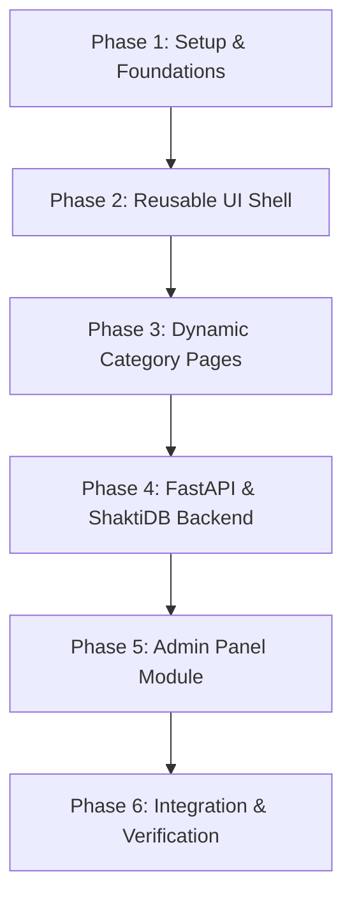

# Figma Analysis & Project Architecture Plan

This document provides a deep architectural analysis of the **Comptroller and Auditor General (CAG) of India** website design based on the 16 mockup frames inside [`section_5_2.svg`](file:///c:/Users/SEC/Desktop/CAG_figma/section_5_2.svg).

> [!NOTE]
> All 16 vector mockups use a desktop grid layout of `1440px` width. The text elements have been vector-outlined, and binary assets (portraits, diagrams) are embedded inline via base64 definitions in the SVG's `<defs>`.

---

## 1. Figma Page to Next.js Route Mapping

Below is the mapping from the 16 visual mockup states to Next.js App Router dynamic routes:

| Figma Mockup (X, Y) | Visual Description & State | Next.js App Router Route | Data Source |
| :--- | :--- | :--- | :--- |
| **Mockup 1** (340, 340) | Home Page (Default view) | `/` | Dynamic (Latest Reports, Statistics) |
| **Mockup 2** (1980, 340) | Home Page (Menu dropdown open) | `/` (Interactive client state) | Static |
| **Mockup 3** (3620, 340) | Reports Directory (Default list) | `/reports` | Dynamic (Report Grid) |
| **Mockup 4** (5260, 340) | Reports Directory (Filters selected) | `/reports?sector=...&level=...` | Dynamic (API Filtering) |
| **Mockup 5** (7700, 340) | About Menu overlay state 1 | Layout Submenu | Static |
| **Mockup 6** (7755, 2902) | About Menu overlay state 2 | Layout Submenu | Static |
| **Mockup 7** (9340, 340) | Vision, Mission & Values (Top) | `/about/vision-mission` | Static/Database-driven |
| **Mockup 8** (9340, 2902) | Vision, Mission & Values (Bottom) | `/about/vision-mission` | Static/Database-driven |
| **Mockup 9** (10980, 340) | Organisation Chart (Default tree) | `/about/organisation-chart` | Dynamic (Officer Hierarchy API) |
| **Mockup 10** (12620, 340) | Org Chart (Officer card expanded) | `/about/organisation-chart` (Client state) | Dynamic (Officer Contact API) |
| **Mockup 11** (14260, 340) | History of IAAD (Chronology) | `/about/history` | Static/Database-driven |
| **Mockup 12** (14260, 2631) | History of IAAD (Downloads section) | `/about/history` | Dynamic (Document Download API) |
| **Mockup 13** (15900, 340) | Former CAGs Gallery Grid | `/about/former-cags` | Dynamic (CAG History API) |
| **Mockup 14** (17540, 340) | Current CAG Profile Biography | `/about/cag-profile` | Dynamic (Biography API) |
| **Mockup 15** (19180, 340) | International Relations & Engagements | `/about/international-relations` | Dynamic (Engagements API) |
| **Mockup 16** (20820, 340) | Audit Advisory Board Members | `/about/audit-advisory-board` | Dynamic (Board Members API) |

---

## 2. Category & Subcategory Hierarchy

As per **Section 3** of the project requirements, the application will use dynamic routing to avoid repeating similar layouts. The main category folders in Next.js will be `/about` and `/reports`.

```text
app/
├── layout.tsx                # AppShell (Navbar + Footer)
├── page.tsx                  # Home Page Mockup 1
├── reports/
│   ├── page.tsx              # Reports Search Directory (Mockups 3 & 4)
│   └── [sector]/
│       └── page.tsx          # Dynamic page for specific sector reports
├── about/
│   ├── page.tsx              # Fallback / About landing page
│   ├── [subcategory]/
│   │   └── page.tsx          # Dynamic subcategory pages (Mockups 7 to 16)
```

### Static vs. Dynamic Content Matrix
> [!IMPORTANT]
> To comply with the Figma design, branding logos, footer columns, and main navigation headers are static, whereas all tabular databases, board lists, directories, and biography descriptions must be loaded from FastAPI via dynamic state.

*   **Static Assets**: CAG official logos, Intosai logos, ASOSAI seals, vector icons.
*   **Dynamic Data**:
    *   *Reports Grid*: List of reports, sectors, and PDF downloads.
    *   *Organisation Chart*: Officer contact cards and hierarchical structure.
    *   *Former CAGs*: Gallery of former CAGs with names, tenures, and portraits.
    *   *Audit Advisory Board*: Board lists and external member details.

---

## 3. Reusable Frontend Components

We will implement a shared shell architecture using Next.js App Router layout system.

```text
components/
├── common/
│   ├── Navbar.tsx             # Global desktop navbar with flyouts (Mockup 2/5/6)
│   ├── Footer.tsx             # Institutional footer (Mockups 1/3/9)
│   ├── Breadcrumb.tsx         # Page navigation path locator
│   └── Button.tsx             # Standard buttons (Audit Reports, Search)
├── reports/
│   ├── SidebarFilters.tsx     # Left-side accordion filter controls (Mockup 3/4)
│   ├── ReportCard.tsx         # Reusable card for download options
│   └── Pagination.tsx         # Directory grid paging controller
├── about/
│   ├── OrgChartTree.tsx       # Hierarchy tree renderer (Mockup 9/10)
│   ├── OfficerCard.tsx        # Standard officer detail card with modal flyout
│   ├── BiographyCard.tsx      # Main profile layout for current CAG (Mockup 14)
│   └── DocumentList.tsx       # Download table for thematic history chapters (Mockup 12)
```

---

## 4. REST API Specification (FastAPI Backend)

FastAPI will provide clean separation between routes, business services, and database repositories.

### Public API Endpoints
*   `GET /api/navigation`  
    Returns dynamic categories and subcategories mapping for the header dropdown lists.
*   `GET /api/pages/{slug}`  
    Fetches the content blocks (headings, body HTML, image URLs) for specific pages like `/about/vision-mission` or `/about/cag-profile`.
*   `GET /api/reports`  
    Query Params: `sector`, `level`, `type`, `query`, `page`, `page_size`.  
    Returns paginated report meta-cards matching criteria.
*   `GET /api/officers`  
    Returns hierarchical JSON tree for organisation chart.
*   `GET /api/former-cags`  
    Returns collection of former CAGs list ordered by start date.
*   `GET /api/advisory-board`  
    Returns list of external and internal board members.

### Admin API Endpoints (Auth Protected)
*   `POST|PUT|DELETE /api/admin/reports`  
    Manage report cards, metadata, and PDF links.
*   `POST|PUT|DELETE /api/admin/officers`  
    Update officer details or reporting lines inside organisation chart.
*   `POST|PUT /api/admin/pages`  
    Manage HTML/Text blocks for dynamic subcategory pages.

---

## 5. ShaktiDB Database Schema Design

Based on the dynamic sections identified, the database schema will contain these models:

### 1. `Category`
*   `id`: Primary Key (UUID)
*   `name`: String
*   `slug`: String (Index, Unique)

### 2. `Subcategory`
*   `id`: Primary Key (UUID)
*   `category_id`: Foreign Key (`Category.id`)
*   `name`: String
*   `slug`: String (Index, Unique)

### 3. `PageContent`
*   `id`: Primary Key (UUID)
*   `subcategory_id`: Foreign Key (`Subcategory.id`, Nullable)
*   `slug`: String (Index, Unique)
*   `title`: String
*   `content_blocks`: JSON (Stores paragraphs, quotes, and layouts)
*   `meta_title`: String
*   `meta_description`: String

### 4. `Report`
*   `id`: Primary Key (UUID)
*   `title`: String (Index)
*   `sector`: String (Index) (e.g., Defence, Social, Transport)
*   `admin_level`: String (Index) (e.g., Union, State, Local)
*   `report_type`: String (Index) (e.g., Performance, Compliance)
*   `published_date`: Date (Index)
*   `file_url`: String (Link to PDF)
*   `description`: Text

### 5. `Officer`
*   `id`: Primary Key (UUID)
*   `name`: String
*   `designation`: String
*   `email`: String
*   `phone`: String
*   `tier`: Integer (e.g., 1 for CAG, 2 for Dy. CAGs)
*   `parent_id`: Foreign Key (`Officer.id`, Nullable for hierarchy tree)

### 6. `FormerCAG`
*   `id`: Primary Key (UUID)
*   `name`: String
*   `start_date`: Date
*   `end_date`: Date
*   `image_url`: String
*   `description`: Text

---

## 6. Next Phase: Implementation Milestones

To proceed systematically, we propose dividing the next coding efforts into distinct tasks:



1.  **Phase 1**: Initialize Next.js 14/15 App Router codebase with TypeScript, global theme styles matching the Figma color palette (emerald/green `#267C55`, clean gray backgrounds `#E1E1E1`, and dark typography `#2A2A2A`).
2.  **Phase 2**: Implement the Shared Shell layout (`Navbar`, `Footer`, `Breadcrumb`).
3.  **Phase 3**: Create dynamic category structures (`/reports` directory layout and `/about/[subcategory]` dynamic viewer).
4.  **Phase 4**: Develop FastAPI app structure, ShaktiDB connection repository, and API routes.
5.  **Phase 5**: Create the admin panel routes for managing dynamic data cards.
