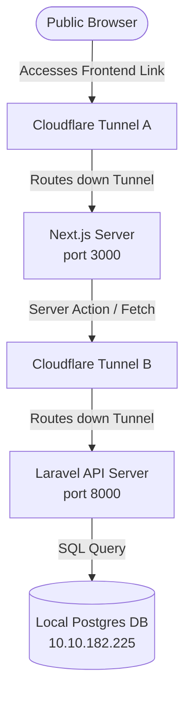

# How the Local-to-Cloud Tunnel Deployment Works

This document explains in simple terms how the CAG Portal is exposed to the public internet while keeping your local PostgreSQL database secure on its private network.

---

## 🗺️ High-Level Concept: "The Secure Bridge"
Think of your computer as a secure building with no public doors, and the internet as the outside world.
- A **Cloudflare Tunnel (`cloudflared`)** acts as a private, secure bridge built from inside your computer to Cloudflare's network.
- Anyone on the internet can walk across this bridge to view the website, but they **cannot** see or access your local files or database directly.



---

## ⚡ Step-by-Step Data Flow

### Step 1: Loading the Website
1. You visit the public Frontend Link: `https://restored-judge-hydrogen-ride.trycloudflare.com`
2. Cloudflare receives this request and routes it down **Tunnel A** directly to your local computer's **Next.js server (Port 3000)**.
3. Next.js processes the request and sends the homepage back to your browser.

### Step 2: Database Operations (e.g. Logging in or viewing lists)
1. When you type your password and click **Login**, Next.js needs to verify it against the database.
2. The Next.js server makes a backend call to **Tunnel B**: `https://patients-dim-horizon-gps.trycloudflare.com/api/admin/login`
3. Cloudflare routes this call down the tunnel directly to your local **Laravel API server (Port 8000)**.
4. Laravel connects directly to your private PostgreSQL Database (`10.10.182.225`), verifies the hashed password, and sends a success token back.

---

## 🛠️ The 3 Core Components

| Component | Where it Runs | Role |
| :--- | :--- | :--- |
| **Local PostgreSQL** | Private Local Network (`10.10.182.225`) | Securely stores all your audit logs, users, news, and reports. It is completely hidden from the internet. |
| **Local Web Servers** | Your Local Host (Ports `3000` & `8000`) | Serves the Next.js visual pages and processes Laravel backend business logic. |
| **Cloudflare Tunnels** | Run by `cloudflared.exe` | Creates the secure outgoing connection to Cloudflare edge networks, giving you public URLs. |

---

## ❓ FAQ for Freshers

#### 1. Why is this 100% free of charge?
We are using **Cloudflare Quick Tunnels** (run via `cloudflared tunnel --url`). Cloudflare provides these temporary, randomly-named tunnels completely for free to help developers test local servers on the internet. You do not need to register, own a domain, or register credit cards.

#### 2. What happens if I close my terminal or turn off my PC?
Since the code, database, and tunnels are running locally on your computer, closing the terminal or turning off the PC will stop the servers and close the tunnels. The links will show a Cloudflare "502 Bad Gateway" error until you start them again.

#### 3. How do I start them again?
Whenever you want to run the portal live:
1. Start your database and local servers (Laragon / Next.js).
2. Start the tunnels by running:
   ```bash
   # Expose Next.js
   cloudflared tunnel --url http://localhost:3000
   
   # Expose Laravel
   cloudflared tunnel --url http://localhost:8000
   ```
