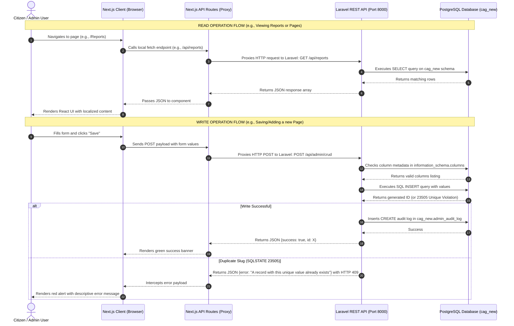

# CAG Portal - Developer Guide & Project Architecture

Welcome to the **Comptroller and Auditor General (CAG) of India** portal project. This document serves as a complete onboarding guide for freshers and new developers, outlining the architecture, folder structure, data workflow, and administrative components.

---

## 🏛️ Project Architecture & Communication Flow

The application uses a **Decoupled (Headless) Architecture** consisting of a Next.js frontend communicating with a Laravel backend API, backed by a PostgreSQL database.

### 🔄 Dynamic Request & Workflow Diagram



---

## 📂 Project Directory Structure

Here is a detailed breakdown of every directory and file in the workspace to help you understand the role of each folder.

```text
new CAG/
├── proj_details.md                             # Onboarding guide (this file)
└── cag_laravel/                                # Main Project Root
    ├── app/                                    # CORE LARAVEL APPLICATION CODE
    │   ├── Console/                            # Artisan Commands & Task schedules definitions
    │   ├── Exceptions/                         # Global application exception handlers
    │   ├── Models/                             # Eloquent Models matching pgsql tables
    │   │   ├── AdminAuditLog.php               # Handles user actions audit trail logs
    │   │   ├── Banner.php                      # Handles homepage carousel banners
    │   │   ├── Page.php                        # CMS page models
    │   │   └── ... (24 other models)           # Core domain models mapping all 27 tables
    │   ├── Providers/                          # Service Providers registering Laravel modules
    │   └── Http/                               # HTTP Request Handling Layers
    │       ├── Controllers/                    # Controllers processing requests & returning responses
    │       │   └── Api/                        # REST API controllers
    │       │       ├── Admin/                  # Administrative CRUD & Upload endpoints
    │       │       │   ├── AdminCrudController.php   # Central CRUD operations (CREATE/READ/UPDATE/DELETE)
    │       │       │   ├── AdminOptionsController.php # Fetches values for form dropdown selectors
    │       │       │   └── AdminUploadController.php  # Handles image/file uploads validation & storage
    │       │       └── Public/                 # Public content endpoints (News, Reports, Former CAGs)
    │       └── Middleware/                     # CORS filters, authentication guards, input trimming
    │
    ├── bootstrap/                              # Bootstrapping files (app.php configures routes, middleware)
    ├── config/                                 # Configurations (database connections, app keys, cors settings)
    ├── database/                               # DATABASE MIGRATIONS & SEEDING LAYERS
    │   ├── migrations/                         # SQL Schema creation files
    │   └── seeders/                            # Populates seed data (e.g., SampleDataSeeder, AdminUserSeeder)
    │
    ├── public/                                 # WEB ROOT FOR LARAVEL (Entry point: index.php)
    │   └── storage -> ../storage/app/public     # Symlink allowing web browsers to retrieve uploaded files
    │
    ├── resources/                              # FRONTEND BLADE TEMPLATES (Used as developer fallbacks)
    │   └── views/                              # Public Blade templates (reports/index.blade.php)
    │
    ├── routes/                                 # ROUTING REGISTRIES
    │   ├── api.php                             # REST endpoints route mapping (/api/admin/*)
    │   └── web.php                             # Default web routes mapping fallback templates
    │
    ├── storage/                                # INTERNAL SYSTEM STORAGE (Logs, Cache, Uploads)
    │   ├── app/public/admin-uploads/           # Uploaded banner images and PDFs are stored here
    │   └── logs/laravel.log                    # Target log file for debugging application crashes
    │
    └── frontend/                               # NEXT.JS FRONTEND APPLICATION ROOT
        ├── public/                             # Public static assets folder
        │   ├── admin-uploads/                  # Next.js static uploads mirror
        │   └── assets/images/                  # Static design images (e.g., official cag-logo.png)
        │
        ├── src/                                # FRONTEND SOURCE ROOT
        │   ├── app/                            # NEXT.JS APP ROUTER DIRECTORY
        │   │   ├── (pages)/                    # Public citizens pages (Reports, Presence, etc.)
        │   │   ├── admin/                      # Admin panel page routers
        │   │   │   ├── dashboard/              # Home metrics dashboard page (page.tsx)
        │   │   │   └── [module]/               # Dynamic dynamic routes for CRUD handlers
        │   │   │       ├── page.tsx            # Dynamic list table
        │   │   │       ├── add/page.tsx        # Dynamic add form
        │   │   │       └── [id]/edit/page.tsx  # Dynamic edit form
        │   │   ├── api/                        # Next.js route handlers acting as CORS proxies
        │   │   │   ├── admin/crud/route.ts     # Proxies POST/PUT/DELETE requests to Laravel
        │   │   │   └── presence/route.ts       # Proxies central office details requests
        │   │   └── login/                      # Administration authentication login portal page
        │   │
        │   ├── Components/                     # REUSABLE FRONTEND REACT COMPONENTS
        │   │   ├── admin/                      # Admin components (Sidebar, GenForm, DataTable, FileUpload)
        │   │   ├── Header/                     # Public site navigation header
        │   │   └── Footer/                     # Public site information footer
        │   │
        │   └── lib/                            # TYPESCRIPT LIBRARIES & HELPER SCRIPTS
        │       ├── admin-modules.ts            # Declarative config map (forms layout & column types for all 27 tables)
        │       └── db.ts                       # Browser-safe client database abstraction layer
```

---

## 🔄 Dynamic Abstract CRUD Architecture

Rather than writing 27 separate sets of lists, forms, and updates, the admin panel uses a **Declarative Catch-All Routing Architecture**:

1. **Dynamic URL Resolving**:
   - `/admin/[module]/` matches dynamic pages like `/admin/media-gallery`, `/admin/news`, or `/admin/audit-reports`.
   - The route retrieves module schemas configuration declaratively from [`admin-modules.ts`](file:///c:/Users/yokes/OneDrive/Desktop/new%20CAG/cag_laravel/frontend/src/lib/admin-modules.ts).

2. **Listing View (`GenListPage.tsx`)**:
   - Fetches paginated tables rows directly from Laravel API `/api/admin/crud?table={table_name}`.
   - Renders a search input and dynamic data columns mapped from the module configuration.

3. **Creation & Editing (`GenForm.tsx`)**:
   - Renders form inputs dynamically based on fields definition (text, textarea, rich-text, select dropdown, date, file, boolean).
   - On save, sends a JSON payload to `/api/admin/crud` proxy, which executes a `POST` or `PUT` request to Laravel.

---

## 🛠️ Onboarding Setup & Installation

Follow these steps to spin up the local development environment:

### 1. Backend Setup (Laravel)
Navigate to the root directory `cag_laravel/`:
```bash
# Install PHP dependencies
composer install

# Create local storage symlink for image uploads
php artisan storage:link

# Start the Laravel REST API server on Port 8000
php artisan serve --host=127.0.0.1 --port=8000
```

### 2. Frontend Setup (Next.js)
Navigate to the frontend directory `cag_laravel/frontend/`:
```bash
# Install Node dependencies
npm install

# Start Next.js Development Server on Port 3000
npm run dev
```

## 🖥️ The Two-Server Development Architecture

To support modern UI development while retaining a robust API backend, this project is split into two independent server engines:

### 1. The Backend Engine (Laravel - Port 8000)
The backend is built using Laravel and follows the traditional **Model-View-Controller (MVC)** architectural pattern:
- **Model (M)**: Located in [`app/Models/`](file:///c:/Users/yokes/OneDrive/Desktop/new%20CAG/cag_laravel/app/Models/). These are Eloquent models that define the schemas, relationships, and queries mapping to the tables in the `cag_new` schema in PostgreSQL (e.g., [`Page.php`](file:///c:/Users/yokes/OneDrive/Desktop/new%20CAG/cag_laravel/app/Models/Page.php), [`AdminAuditLog.php`](file:///c:/Users/yokes/OneDrive/Desktop/new%20CAG/cag_laravel/app/Models/AdminAuditLog.php)).
- **View (V)**: Located in [`resources/views/`](file:///c:/Users/yokes/OneDrive/Desktop/new%20CAG/cag_laravel/resources/views/). Contains PHP Blade templates (`.blade.php`) representing the legacy public portal layouts and elements served directly on Port 8000.
- **Controller (C)**: Located in [`app/Http/Controllers/`](file:///c:/Users/yokes/OneDrive/Desktop/new%20CAG/cag_laravel/app/Http/Controllers/). Controllers handle routing parameters, query execution, file validations, and response output (e.g., [`AdminCrudController.php`](file:///c:/Users/yokes/OneDrive/Desktop/new%20CAG/cag_laravel/app/Http/Controllers/Api/Admin/AdminCrudController.php)).

### 2. The Frontend Engine (Next.js - Port 3000)
The frontend is a modern, component-driven React application using the Next.js App Router:
- **Client Views & Layouts**: Written as React Server Components (RSC) and Client Components (using `'use client'`) located in [`frontend/src/app/`](file:///c:/Users/yokes/OneDrive/Desktop/new%20CAG/cag_laravel/frontend/src/app/) (e.g., [`page.tsx`](file:///c:/Users/yokes/OneDrive/Desktop/new%20CAG/cag_laravel/frontend/src/app/page.tsx), [`dashboard/page.tsx`](file:///c:/Users/yokes/OneDrive/Desktop/new%20CAG/cag_laravel/frontend/src/app/admin/dashboard/page.tsx)).
- **API Proxy Layer**: Serves as a gateway between client-side browser actions and the Laravel backend API to bypass CORS limitations. Located in [`frontend/src/app/api/`](file:///c:/Users/yokes/OneDrive/Desktop/new%20CAG/cag_laravel/frontend/src/app/api/) (e.g., [`crud/route.ts`](file:///c:/Users/yokes/OneDrive/Desktop/new%20CAG/cag_laravel/frontend/src/app/api/admin/crud/route.ts)).

---

## 🌐 Secure Local-to-Cloud Deployment Workflow
Because the PostgreSQL database host is a private local network IP (`10.10.182.225`), public cloud hosting platforms (like AWS or Vercel) cannot access it directly. We resolve this securely using **Cloudflare Quick Tunnels** (`cloudflared`):

1. **How the Tunnel Works**:
   - `cloudflared.exe` creates an outgoing secure websocket connection (a bridge) from your local computer to Cloudflare's edge network.
   - Since the connection starts *inside* your network, it bypasses firewalls and does not require opening ports or assigning public IPs.

2. **Exposing the Tunnels**:
   - **Frontend Tunnel (Port 3000)**: Receives public browser requests and forwards them to your local Next.js server.
   - **Backend Tunnel (Port 8000)**: Receives backend API fetches and forwards them to your local Laravel REST controllers.

3. **Data Synchronicity**:
   - The Next.js frontend connects to the backend tunnel URL (`NEXT_PUBLIC_LARAVEL_API_URL`) to execute database actions.
   - Laravel queries the local PostgreSQL database (`10.10.182.225`) directly, returning synchronized data instantly!

---

## ⚠️ Important Developer Guidelines (Tips & Gotchas)

1. **Database Schema Constraints & Safe Insertion**:
   - Always resolve column names directly from the PostgreSQL schema dictionary using the helper `getTableColumns($table)` in `AdminCrudController` instead of `Schema::getColumnListing($table)`. This prevents Laravel from querying the default `public` schema instead of `cag_new`.
   - Wrapping database operations in try-catch blocks checks PostgreSQL Unique violations (`SQLSTATE 23505`) and returns a helpful error string to the user instead of throwing raw 500 errors.

2. **Handling Unique Constraints**:
   - URL Slugs for CMS pages must be unique. If saving fails with a conflict, make sure you aren't attempting to save a duplicate slug (like `#` which is already taken by the `"test"` page).

3. **Branding CSS & Gradients**:
   - Avoid hardcoding theme colors in styling tags. Use CSS custom variables like `var(--cag-green)` (currently mapped to the official maroon `#751639`) and `var(--cag-green-hover)` to ensure design consistency across public pages and the administrative dashboard.
