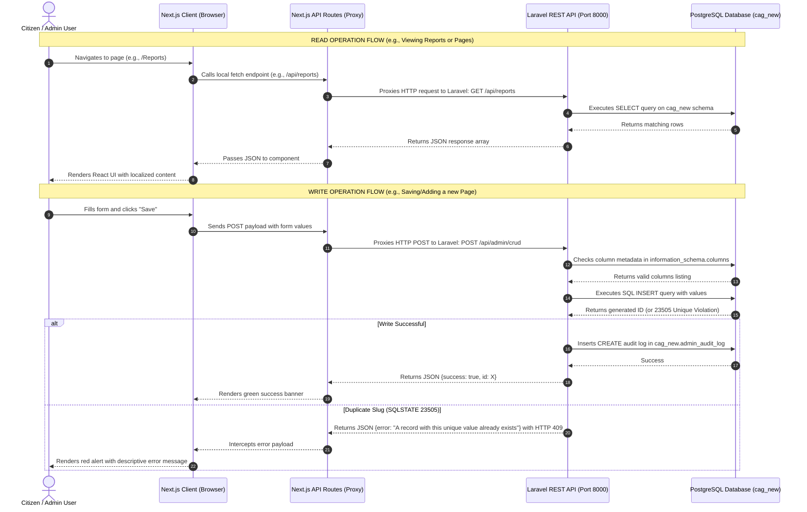

# CAG Portal - Developer Guide & Project Architecture

Welcome to the **Comptroller and Auditor General (CAG) of India** portal project. This document serves as a complete onboarding guide for freshers and new developers, outlining the architecture, folder structure, data workflow, and administrative components.

---

## 🏛️ Project Architecture & Communication Flow

The application uses a **Decoupled (Headless) Architecture** consisting of a Next.js frontend communicating with a Laravel backend API, backed by a PostgreSQL database.

### 🔄 Dynamic Request & Workflow Diagram



---

## 📂 Project Directory Structure & Detailed Folder Usage

Below is a comprehensive guide to every folder in the workspace, detailing what it contains, how it operates, and its role in the project.

### 1. 🖥️ Laravel Backend Folder Directory (`cag_laravel/`)

*   **`app/` (Core PHP Application Logic)**:
    *   **`app/Console/`**: Contains Artisan commands and scheduled background task definitions. If you need to write a CLI script (e.g. to import data or reset records), it belongs here.
    *   **`app/Exceptions/`**: Global error handling. Intercepts database connection issues, validation errors, or application crashes and formats them into clean HTTP responses.
    *   **`app/Http/Controllers/Api/Admin/`**: REST API endpoints for the administration panel:
        *   [`AdminCrudController.php`](file:///c:/Users/yokes/OneDrive/Desktop/new%20CAG/cag_laravel/app/Http/Controllers/Api/Admin/AdminCrudController.php): A dynamic, catch-all CRUD controller. It uses schema metadata query helpers (`getTableColumns()`) to automatically insert, update, read, and delete records for any of the 27 database tables without requiring separate controllers for each.
        *   [`AdminOptionsController.php`](file:///c:/Users/yokes/OneDrive/Desktop/new%20CAG/cag_laravel/app/Http/Controllers/Api/Admin/AdminOptionsController.php): Exposes endpoint routes to fetch data lists needed for form dropdown selectors (e.g., selecting parent pages, categories, or audit reports).
        *   [`AdminUploadController.php`](file:///c:/Users/yokes/OneDrive/Desktop/new%20CAG/cag_laravel/app/Http/Controllers/Api/Admin/AdminUploadController.php): Validates, stores, and registers uploaded images, icons, or PDF reports in the server storage.
        *   [`AuthController.php`](file:///c:/Users/yokes/OneDrive/Desktop/new%20CAG/cag_laravel/app/Http/Controllers/Api/Admin/AuthController.php): Verifies credentials, handles secure Bcrypt password checking, and logs entry details inside the audit trail log database.
    *   **`app/Http/Controllers/Api/Public/`**: Contains controllers handling read-only queries from the citizen-facing public homepage (e.g., retrieving published audit reports, news updates, career tenders, etc.).
    *   **`app/Http/Middleware/`**: Handles HTTP filtering. Configured with CORS filters (allowing Next.js port 3000 to talk to port 8000), authentication checking, and trimming request payloads.
    *   **`app/Models/`**: Eloquent models mapping table schemas to database queries:
        *   [`AdminUser.php`](file:///c:/Users/yokes/OneDrive/Desktop/new%20CAG/cag_laravel/app/Models/AdminUser.php): Maps the administrator accounts table.
        *   [`AdminAuditLog.php`](file:///c:/Users/yokes/OneDrive/Desktop/new%20CAG/cag_laravel/app/Models/AdminAuditLog.php): Captures administrative actions (User, Operation, Timestamp, Target Table, Modified Data) to maintain a complete security log.
        *   `Page.php`, `Report.php`, `Tender.php`, etc.: Model schemas for the 27 CMS tables.
    *   **`app/Providers/`**: System boot registers. Configures routing paths, validation overrides, and database bindings.

*   **`config/` (System Configurations)**:
    *   `database.php`: Handles PostgreSQL connection host, schema definitions, and credentials.
    *   `cors.php`: Crucial configuration file allowing browser cross-origin requests from the Next.js frontend port.
    *   `filesystems.php`: Manages local disks, upload sizes, and symlink mappings.

*   **`database/` (Database Migrations & Seeders)**:
    *   **`database/migrations/`**: Contains the SQL blueprint scripts used to generate the PostgreSQL tables, indexes, and primary/foreign keys in the `cag_new` schema.
    *   **`database/seeders/`**: Populates the database with default records:
        *   [`AdminUserSeeder.php`](file:///c:/Users/yokes/OneDrive/Desktop/new%20CAG/cag_laravel/database/seeders/AdminUserSeeder.php): Sets up the default `admin` / `admin` login credentials.
        *   `SampleDataSeeder.php`: Populates test data for audit reports, career postings, and news.

*   **`resources/views/` (Legacy Web Views)**:
    *   Contains fallback HTML/PHP Blade templates (served on port 8000). The main user-facing homepage is now handled by Next.js, but these remain as legacy views.

*   **`routes/` (URL Routing Registries)**:
    *   `api.php`: Maps all backend URL paths (e.g. `/api/admin/crud`, `/api/admin/login`) to the appropriate API controller actions.
    *   `web.php`: Registers fallback page routing for port 8000.

*   **`storage/app/public/admin-uploads/` (Uploaded Files)**:
    *   This is the actual server folder where files uploaded through the admin forms (like PDF documents and banner images) are saved permanently.

---

### 2. ⚡ Next.js Frontend Folder Directory (`cag_laravel/frontend/`)

*   **`public/` (Static Frontend Assets)**:
    *   **`public/assets/images/`**: Holds graphics like the official CAG maroon logo emblem ([`cag-logo.png`](file:///c:/Users/yokes/OneDrive/Desktop/new%20CAG/cag_laravel/frontend/public/assets/images/cag-logo.png)) displayed on the login card and headers.
    *   **`public/admin-uploads/`**: Serves as a local dev path matching the backend uploads directory for browser loading.

*   **`src/app/` (Next.js App Router Controllers & Pages)**:
    *   **`src/app/(pages)/`**: Public citizen pages:
        *   `Home-page/`: Homepage grids, news feeds, and layout banners.
        *   `Reports/`: Browse audit reports.
        *   `About/`, `Tenders/`, `Recruitment/`: Static and dynamic sub-pages.
    *   **`src/app/admin/` (Administration UI Page Controllers)**:
        *   `dashboard/`: Home admin screen displaying database row metrics and recent audit logs.
        *   `[module]/page.tsx`: Standard listing view. Loads table layouts dynamically depending on which module URL slug is opened.
        *   `[module]/add/page.tsx`: Layout representing the new record creation screen.
        *   `[module]/[id]/edit/page.tsx`: Layout representing the record update form.
        *   `[module]/[id]/page.tsx`: Detail page rendering all table attributes, including document previews.
    *   **`src/app/api/` (Next.js Node Server Proxies)**:
        *   `api/admin/crud/route.ts`: Node-side API handler that proxies form submissions (saving, editing, deleting) to the Laravel backend port.
        *   `api/admin/upload/route.ts`: Proxies file upload binaries securely.
    *   **`src/app/(auth)/login/`**: Page displaying the maroon themed admin sign-in form.

*   **`src/Components/admin/` (Interactive Admin Widgets)**:
    *   [`GenForm.tsx`](file:///c:/Users/yokes/OneDrive/Desktop/new%20CAG/cag_laravel/frontend/src/Components/admin/GenForm.tsx): The form generator. Interprets schema data types and dynamically renders inputs (text, textareas, rich-text WYSIWYG editor, dates, checkbox toggles, or drop-downs).
    *   [`DataTable.tsx`](file:///c:/Users/yokes/OneDrive/Desktop/new%20CAG/cag_laravel/frontend/src/Components/admin/DataTable.tsx): Renders tabular records, search bars, pagination, and action icons.
    *   [`FileUpload.tsx`](file:///c:/Users/yokes/OneDrive/Desktop/new%20CAG/cag_laravel/frontend/src/Components/admin/FileUpload.tsx): Integrated upload widget showing selected filenames, icons, and inline previews.
    *   [`ListClientHelpers.tsx`](file:///c:/Users/yokes/OneDrive/Desktop/new%20CAG/cag_laravel/frontend/src/Components/admin/ListClientHelpers.tsx): Contains standard client actions, including [`FilePreviewAction`](file:///c:/Users/yokes/OneDrive/Desktop/new%20CAG/cag_laravel/frontend/src/Components/admin/ListClientHelpers.tsx#L96-L168) which displays images or opens PDF iframe overlays with a direct download button.

*   **`src/lib/` (Libraries & Core Constants)**:
    *   [`admin-modules.ts`](file:///c:/Users/yokes/OneDrive/Desktop/new%20CAG/cag_laravel/frontend/src/lib/admin-modules.ts): **The Central Schema Mapping Configuration**. Every table name, form input type, field label, select options fetch query, and table column is configured in this map.
    *   [`db.ts`](file:///c:/Users/yokes/OneDrive/Desktop/new%20CAG/cag_laravel/frontend/src/lib/db.ts): Connects to the database directly for specific server-side Next.js operations.
    *   [`auth.ts`](file:///c:/Users/yokes/OneDrive/Desktop/new%20CAG/cag_laravel/frontend/src/lib/auth.ts) & [`auth.config.ts`](file:///c:/Users/yokes/OneDrive/Desktop/new%20CAG/cag_laravel/frontend/src/lib/auth.config.ts): Sets up NextAuth credential providers, route guards, and session expiration times.

---

## 🔄 Dynamic Abstract CRUD Architecture

Rather than writing 27 separate sets of lists, forms, and updates, the admin panel uses a **Declarative Catch-All Routing Architecture**:

1. **Dynamic URL Resolving**:
   - `/admin/[module]/` matches dynamic pages like `/admin/media-gallery`, `/admin/news`, or `/admin/audit-reports`.
   - The route retrieves module schemas configuration declaratively from [`admin-modules.ts`](file:///c:/Users/yokes/OneDrive/Desktop/new%20CAG/cag_laravel/frontend/src/lib/admin-modules.ts).

2. **Listing View (`GenListPage.tsx`)**:
   - Fetches paginated tables rows directly from Laravel API `/api/admin/crud?table={table_name}`.
   - Renders a search input and dynamic data columns mapped from the module configuration.

3. **Creation & Editing (`GenForm.tsx`)**:
   - Renders form inputs dynamically based on fields definition (text, textarea, rich-text, select dropdown, date, file, boolean).
   - On save, sends a JSON payload to `/api/admin/crud` proxy, which executes a `POST` or `PUT` request to Laravel.

---

## 🛠️ Onboarding Setup & Installation

Follow these steps to spin up the local development environment:

### 1. Backend Setup (Laravel)
Navigate to the root directory `cag_laravel/`:
```bash
# Install PHP dependencies
composer install

# Create local storage symlink for image uploads
php artisan storage:link

# Start the Laravel REST API server on Port 8000
php artisan serve --host=127.0.0.1 --port=8000
```

### 2. Frontend Setup (Next.js)
Navigate to the frontend directory `cag_laravel/frontend/`:
```bash
# Install Node dependencies
npm install

# Start Next.js Development Server on Port 3000
npm run dev
```

## 🖥️ The Two-Server Development Architecture

To support modern UI development while retaining a robust API backend, this project is split into two independent server engines:

### 1. The Backend Engine (Laravel - Port 8000)
The backend is built using Laravel and follows the traditional **Model-View-Controller (MVC)** architectural pattern:
- **Model (M)**: Located in [`app/Models/`](file:///c:/Users/yokes/OneDrive/Desktop/new%20CAG/cag_laravel/app/Models/). These are Eloquent models that define the schemas, relationships, and queries mapping to the tables in the `cag_new` schema in PostgreSQL (e.g., [`Page.php`](file:///c:/Users/yokes/OneDrive/Desktop/new%20CAG/cag_laravel/app/Models/Page.php), [`AdminAuditLog.php`](file:///c:/Users/yokes/OneDrive/Desktop/new%20CAG/cag_laravel/app/Models/AdminAuditLog.php)).
- **View (V)**: Located in [`resources/views/`](file:///c:/Users/yokes/OneDrive/Desktop/new%20CAG/cag_laravel/resources/views/). Contains PHP Blade templates (`.blade.php`) representing the legacy public portal layouts and elements served directly on Port 8000.
- **Controller (C)**: Located in [`app/Http/Controllers/`](file:///c:/Users/yokes/OneDrive/Desktop/new%20CAG/cag_laravel/app/Http/Controllers/). Controllers handle routing parameters, query execution, file validations, and response output (e.g., [`AdminCrudController.php`](file:///c:/Users/yokes/OneDrive/Desktop/new%20CAG/cag_laravel/app/Http/Controllers/Api/Admin/AdminCrudController.php)).

### 2. The Frontend Engine (Next.js - Port 3000)
The frontend is a modern, component-driven React application using the Next.js App Router:
- **Client Views & Layouts**: Written as React Server Components (RSC) and Client Components (using `'use client'`) located in [`frontend/src/app/`](file:///c:/Users/yokes/OneDrive/Desktop/new%20CAG/cag_laravel/frontend/src/app/) (e.g., [`page.tsx`](file:///c:/Users/yokes/OneDrive/Desktop/new%20CAG/cag_laravel/frontend/src/app/page.tsx), [`dashboard/page.tsx`](file:///c:/Users/yokes/OneDrive/Desktop/new%20CAG/cag_laravel/frontend/src/app/admin/dashboard/page.tsx)).
- **API Proxy Layer**: Serves as a gateway between client-side browser actions and the Laravel backend API to bypass CORS limitations. Located in [`frontend/src/app/api/`](file:///c:/Users/yokes/OneDrive/Desktop/new%20CAG/cag_laravel/frontend/src/app/api/) (e.g., [`crud/route.ts`](file:///c:/Users/yokes/OneDrive/Desktop/new%20CAG/cag_laravel/frontend/src/app/api/admin/crud/route.ts)).

---

## 🌐 Secure Local-to-Cloud Deployment Workflow
Because the PostgreSQL database host is a private local network IP (`10.10.182.225`), public cloud hosting platforms (like AWS or Vercel) cannot access it directly. We resolve this securely using **Cloudflare Quick Tunnels** (`cloudflared`):

1. **How the Tunnel Works**:
   - `cloudflared.exe` creates an outgoing secure websocket connection (a bridge) from your local computer to Cloudflare's edge network.
   - Since the connection starts *inside* your network, it bypasses firewalls and does not require opening ports or assigning public IPs.

2. **Exposing the Tunnels**:
   - **Frontend Tunnel (Port 3000)**: Receives public browser requests and forwards them to your local Next.js server.
   - **Backend Tunnel (Port 8000)**: Receives backend API fetches and forwards them to your local Laravel REST controllers.

3. **Data Synchronicity**:
   - The Next.js frontend connects to the backend tunnel URL (`NEXT_PUBLIC_LARAVEL_API_URL`) to execute database actions.
   - Laravel queries the local PostgreSQL database (`10.10.182.225`) directly, returning synchronized data instantly!

---

## ⚠️ Important Developer Guidelines (Tips & Gotchas)

1. **Database Schema Constraints & Safe Insertion**:
   - Always resolve column names directly from the PostgreSQL schema dictionary using the helper `getTableColumns($table)` in `AdminCrudController` instead of `Schema::getColumnListing($table)`. This prevents Laravel from querying the default `public` schema instead of `cag_new`.
   - Wrapping database operations in try-catch blocks checks PostgreSQL Unique violations (`SQLSTATE 23505`) and returns a helpful error string to the user instead of throwing raw 500 errors.

2. **Handling Unique Constraints**:
   - URL Slugs for CMS pages must be unique. If saving fails with a conflict, make sure you aren't attempting to save a duplicate slug (like `#` which is already taken by the `"test"` page).

3. **Branding CSS & Gradients**:
   - Avoid hardcoding theme colors in styling tags. Use CSS custom variables like `var(--cag-green)` (currently mapped to the official maroon `#751639`) and `var(--cag-green-hover)` to ensure design consistency across public pages and the administrative dashboard.
